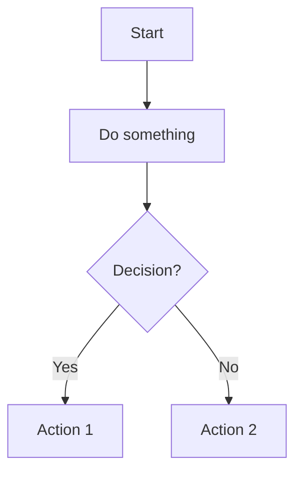

# Markdown Quick Reference

1. **[Core Markdown / CommonMark Spec](#core-markdown--commonmark)**
    1. [Headings](#headings)
    2. [Text Formatting (Emphasis)](#text-formatting-or-emphasis)
    3. [Paragraphs and Line Breaks](#paragraphs-and-line-breaks)
    4. [Horizontal Seperator](#horizontal-seperator)
    5. [Blockquote](#blockquote)
    6. [List (Oredered and Unordered)](#list)
    7. [Code (inline and block)](#code) 
    8. [Links](#links)
    9. [Images](#images)
    10. [Escaping Characters](#escaping-characters)
    11. [HTML](#html)

2. **[GitHub Flavored Markdown (GFM)](#github-flavored-markdown-gfm)**
    1. [Task Lists](#task-lists)
    2. [Tables](#tables)
    3. [Emoji](#emoji)
    4. [Shields & Badges](#shields--badges)
    5. [Mentions & References](#mentions--references)

3. **[Not Supported in Core Markdown or GFM (Extensions Needed)](#not-supported-in-core-markdown-or-gfm-extensions-needed)**
    1. [Equations](#equations)
    2. [Diagrams](#diagrams)
    3. [Footnotes](#footnotes)

4. **[Editors and Viewers](#editors-and-viewers)**

5. **[Further Resources](#further-resources)**

<br>

# Core Markdown / [CommonMark Spec](https://commonmark.org/) 

These are supported across almost all Markdown parsers and viewers (including VS Code preview). 


## Headings

Headings are used to create titles and subtitles. Markdown supports six levels of headings. We use as many (but upto six) hash' ( `#` ) followed by a space followed by text to create that level of header.

***Syntax***
```markdown
# This is header level 1 or H1
```

***Renders as***
# This is header level 1 or H1

<br>

***Syntax***
```markdown
## This is header level 2 or H2
```

***Renders as***
## This is header level 2 or H2

<br>

***Syntax***
```markdown
### This is header level 3 or H3
```

***Renders as***
### This is header level 3 or H3

and so on..

💡 **Tip**

- Heading levels should not be skipped. Use semantic order: H1 → H2 → H3, not H1 → H3.     

<br>

[🔝 Back to Top](#markdown-quick-reference)
<br><br>

## Text Formatting or Emphasis

Text Formatting or Emphasis is used to italicize or bold or strikethrough the text. We can use asterisks ( `*` ) or underscores ( `_` ) for italics or bold text and tilde's ( `~` ) for strikethrough. I have used ( `*` ) for bold and itlics in examples below, you can try them using ( `_` ) instead.

### Italic 
Put the text between a pair of one asterisk ( `* * ` )

***Syntax***
```markdown
*this is italicized text*
```

***Renders as***
*this is italicized text*

<br>

### Bold
Put the text between a pair of two asterisks ( `** ** ` )

***Syntax***
```markdown
**this is bold text**
```

***Renders as***
**this is bold text**

<br>

### Italicized Bold
Put the text between a pair of three asterisks ( `*** *** ` )

***Syntax***
```markdown
***this is italicized bold text***
```

***Renders as***
***this is italicized bold text***

<br>

### Strikethrough 
Strikethrough is used to cross out text. Put the text between a pair of a tilde's ( `~~  ~~` )

***Syntax***
```markdown
~~this is strikethrough text~~
```

***Renders as***
~~this is strikethrough text~~

<br>

[🔝 Back to Top](#markdown-quick-reference)
<br><br>


## Paragraphs and Line Breaks

A paragraph is simply one or more consecutive lines of text, separated by one or more blank lines. To create a line break within a paragraph (referred below as soft break), we can use two or more spaces at the end of the line, or a backslash.

***Syntax***

```markdown
This is a paragraph with two lines.
It continues on the next line.

This is another paragraph.
This line has a soft break.  
This line is also part of the same paragraph.

This line has a soft break.\
This line is also part of the same paragraph.
```

***Renders as***

This is a paragraph.
It continues on the next line.

This is another paragraph.
This line has a soft break.  
This line is also part of the same paragraph.

This line has a soft break.\
This line is also part of the same paragraph.

💡 **Tip**
- Use `<br>` for forced line breaks across tools. Works better than double-space in some editors.

<br>

[🔝 Back to Top](#markdown-quick-reference)
<br><br>

## Horizontal Seperator

Horizontal rules are used to separate content. We can create a horizontal rule by using three or more hyphens ( `-` ), asterisks ( `*` ), or underscores ( `_` ) on a line. I have demonstrated below example using hyphens ( `-` ), you can try with others.

***Syntax***

```markdown
---
```

***Renders as*** 

----

<br>

[🔝 Back to Top](#markdown-quick-reference)
<br><br>


## Blockquote

A Blockquotes is a way to visually emphasize a section of text by indenting it and typically styling it differently (for example, with a left border or italic font). It’s very common for quoting text from another source or for visually highlighting tips, notes, or warnings.

They are created by preceding each line with a `>` character.

### Single Blockquote

***Syntax***

```markdown
> This is a blockquote.
> It can span multiple lines.
```

***Renders as***

> This is a blockquote.
> It can span multiple lines.

<br>

### Nested Blockquote

A Nested Blockquote can be created by multiple greater than symbol ( `> >` ) 

***Syntax***

```markdown
> Single blockquote
> > Nested blockquote.
> > This is still part of the first blockquote.
```

***Renders as***

> Single blockquote
> > Nested blockquote.
> > This is still part of the first blockquote.


💡 **Tip**

- Blockquotes can contain other markdown like lists and code.

<br>

[🔝 Back to Top](#markdown-quick-reference)
<br><br>


## List

Markdown supports both unordered (bulleted) and ordered (numbered) lists.

### Unordered Lists

Unordered lists can be created using asterisks (`*`), plus signs (`+`), or hyphens (`-`) as list markers. I have used ( `*` ) in examples below, you can try other two. All render identically.

***Syntax***

```markdown
* Item 1
* Item 2
  * Sub-item 2.1
  * Sub-item 2.2
* Item 3

* Item A
* Item B

* Item X
* Item Y
```

***Renders as***

* Item 1
* Item 2
  * Sub-item 2.1
  * Sub-item 2.2
* Item 3

* Item A
* Item B

* Item X
* Item Y


<br>

### Ordered Lists

Ordered lists can be created using numbers followed by a period ( `.` ). 

### Basic List
An ordered list is created by prefixing lines with numbers followed by a period (`1.`)

***Syntax***

```md
1. First item
2. Second item
3. Third item

```

***Renders as***

1. First item
2. Second item
3. Third item

<br>

### Nested Ordered Lists
To nest an ordered list inside another, indent by at least 4 spaces or a tab. I have used a tab in examples below

***Syntax***

```markdown
1. First item
2. Second item
3. Third item
    1. Sub-item 3.1
    2. Sub-item 3.2
```

***Renders as***

1. First item
2. Second item
3. Third item
    1. Sub-item 3.1
    2. Sub-item 3.2


💡 **Tip**

- Indent nested list items by 4 spaces or 1 tab. This is required to render properly.
- Use blank lines around blocks. It helps avoid rendering bugs in lists, tables, etc.


<br>

### Mix Ordered & Unordered List

We an mix ordered and unordered lists — useful for breakdowns

***Syntax***

```markdown
1. Fruits
    - Apple
    - Banana
2. Vegetables
    - Carrot
    - Broccoli
```

***Renders as*** 

1. Fruits
    - Apple
    - Banana
2. Vegetables
    - Carrot
    - Broccoli

💡 **Tip**

- Don’t mix list markers. Stick to `-`, `*`, or `+` consistently 

<br>

[🔝 Back to Top](#markdown-quick-reference)
<br><br>

## Code

Code blocks are used to display code snippets. We can use backticks ( ` ) for inline code or triple backticks (```) for multi-line code blocks.

### Inline Code
Put the code between a pair of back quote ( \` ` ` \` )

***Syntax***

```markdown
This is inline code: `print("Hello, World!")`.
```

***Renders as***

This is inline code: `print("Hello, World!")`

<br>

## Code Block
Put the code block between a pair of triple back quote ( \```  ` `  \``` )

***Syntax***

````markdown

```python
def hello_there():
    print("Hello, there!")
```
````
💡 **Tip** 
- I have used **quad backticks** to fence the python code block in markdown — it's widely supported and renders cleanly. 
- You can also achieve the same result by indenting the inner block by 4 spaces or Escape the inner backticks manuall (which is ofcourse bit messy). Indentation-based code blocks (4 spaces) are discouraged today.

***Renders as***

```python
def hello_there():
    print("Hello, there!")
```

<br>

[🔝 Back to Top](#markdown-quick-reference)
<br><br>

## Links

Links are used to connect to other web pages or resources. Markdown supports inline links and reference-style links.

***Syntax***

```markdown
[Zestifai](https://www.zestifai.com)

[Visit Zestifai][1]

[1]: https://www.zestifai.com "Zestifai's Homepage"
```

***Renders as***

[Zestifai](https://www.zestifai.com)

[Visit Zestifai][1]

[1]: https://www.zestifai.com "Zestifai's Homepage"


<br>

[🔝 Back to Top](#markdown-quick-reference)
<br><br>

## Images

Images are embedded in Markdown using a syntax similar to links, but prefixed with an exclamation mark (`!`).

***Syntax***

```markdown


![Alt text for image][logo]

[logo]: https://www.google.com/images/branding/googlelogo/1x/googlelogo_color_272x92dp.png "Google Logo"
```

***Renders as***


![Alt text for image][logo]

[logo]: https://www.google.com/images/branding/googlelogo/1x/googlelogo_color_272x92dp.png "Google Logo"


💡 **Tip** 

- For GitHub, we can drag images into issues/PRs and get the link.

<br>

[🔝 Back to Top](#markdown-quick-reference)
<br><br>


## Escaping Characters

To display a literal character that would otherwise be used to format text in Markdown, we can escape it by preceding it with a backslash (`\`).

***Syntax***

```markdown
\* Not italic \*

\`Not code\`
```

***Renders as***

\* Not italic \*

\`Not code\`


<br>

[🔝 Back to Top](#markdown-quick-reference)
<br><br>


## HTML

Markdown allows us to use raw HTML directly within the Markdown document. This is useful for more complex formatting that Markdown doesn't support natively. Note that not all Markdown engines support all HTML tags.

***Syntax***

```markdown
<p>This is a <b>paragraph</b> with <i>HTML</i> tags.</p>

<span style="color: red;">This text is red</span>


```

***Renders as***

<p>This is a <b>paragraph</b> with <i>HTML</i> tags.</p>

<span style="color: red;">This text is red</span>

<b>Bold using HTML</b>

<details><summary>Click to expand</summary>Hidden content</details>

<br>


💡 **Tip** 

- We can use `<br>` to introduce guaranteed line breaks across renderers, exactly how I have done throughout this document. You can view them when you open this document in "code" mode.

<br>

[🔝 Back to Top](#markdown-quick-reference)
<br><br>


# GitHub Flavored Markdown (GFM)

## Task Lists (Checkboxes)

Task lists are useful for tracking tasks. They are created using hyphens ( `-` ) followed by ( `[ ]` ) for an unchecked task or ( `[x]` ) for a checked task.

***Syntax***

```markdown
1. [x] task completed
2. [x] another task completyed
3. [ ] task in progress
4. [ ] another task in progress
```

***Renders as***

1. [x] task completed
2. [x] another task completyed
3. [ ] task in progress
4. [ ] another task in progress

<br>

[🔝 Back to Top](#markdown-quick-reference)
<br><br>

## Tables

Tables allow us to organize data in rows and columns.

### Basic table

```md
| Column 1 | Column 2 | Column 3 |
| -------- | -------- | -------- |
| Row 1, Cell 1 | Row 1, Cell 2 | Row 1, Cell 3 |
| Row 2, Cell 1 | Row 2, Cell 2 | Row 2, Cell 3 |


```

Rendered as 

| Column 1 | Column 2 | Column 3 |
| -------- | -------- | -------- |
| Row 1, Cell 1 | Row 1, Cell 2 | Row 1, Cell 3 |
| Row 2, Cell 1 | Row 2, Cell 2 | Row 2, Cell 3 |


### Table with content alignment

We can control column text alignment with colons : in the separator line as shown below

```md
| Left Aligned | Center Aligned| Right Aligned|
| :--- | :----: | ----: |
| 1 | 2 | 3 |
| A | B | C |

```

Rendered as 

| Left Aligned | Center Aligned| Right Aligned|
| :--- | :----: | ----: |
| 1 | 2 | 3 |
| A | B | C |


Summary

`:---`  → left-aligned

`:---:` → centered

`---:` → right-aligned

💡 **Tip**

- Escape pipe `|` inside tables using `\|`. This prevents breaking the table structure. 

<br>

[🔝 Back to Top](#markdown-quick-reference)
<br><br>


## Emoji

GitHub supports emoji shortcodes: 

***Syntax***

```md
:rocket:
:smile:
```

***Renders as***
:rocket:
:smile:

💡 **Tip**
- You can get the full list here: [https://github.com/ikatyang/emoji-cheat-sheet](https://github.com/ikatyang/emoji-cheat-sheet)

- You can use VS Extension ":emojisense:" by Matt Bierner to enable suggestions and autocomplete for emoji. Very handy if you use VS Code for editing Markdown documents.

<br>

[🔝 Back to Top](#markdown-quick-reference)
<br><br>

## Callouts (Admonitions)

Markdown doesn't natively support callouts, but we can create visually distinct callouts using **blockquotes + emoji**, especially on GitHub and most Markdown renderers.

These are useful for drawing attention to tips, notes, warnings, or important information.

Use `>` to start a blockquote and include an emoji and a **bolded label**.

***Syntax Structure***
```markdown
> 💡 **Bold-Text:** This is the message.
```

### Info

***Syntax***
```markdown
> ℹ️ **Info:** This provides extra context or explanation.
```

***Renders as***
> ℹ️ **Info:** This provides extra context or explanation.

<br>

### Note

***Syntax***
```markdown
> 📝 **Note:** A useful side remark that readers should be aware of.
```

***Renders as***
> 📝 **Note:** A useful side remark that readers should be aware of.

<br>

### Tip

***Syntax***
```markdown
> 💡 **Tip:** Use keyboard shortcuts like `Cmd+B` for bold in Markdown editors.
```

***Renders as***
> 💡 **Tip:** Use keyboard shortcuts like `Cmd+B` for bold in Markdown editors.

<br>

### Warning

***Syntax***
```markdown
> ⚠️ **Warning:** Indentation errors may cause lists to render incorrectly.
```

***Renders as*** 
> ⚠️ **Warning:** Indentation errors may cause lists to render incorrectly.

<br>

### Important

***Syntax***
```markdown
> ❗ **Important:** GitHub doesn't support native LaTeX equations in `.md` files.
```

***Renders as***
> ❗ **Important:** GitHub doesn't support native LaTeX equations in `.md` files.

<br>

### Caution

***Syntax***
```markdown
> 🚫 **Caution:** Be careful using HTML in Markdown — it may not render everywhere.
```

***Renders as***
> 🚫 **Caution:** Be careful using HTML in Markdown — it may not render everywhere.

<br>

💡 **Tip** 
- Best used in GitHub, Obsidian, or any Markdown viewer that supports emojis

<br>

[🔝 Back to Top](#markdown-quick-reference)
<br><br>


## Shields & Badges

Badges are small visual elements, technically just images with embedded links often used in Markdown files (especially on GitHub). They are clickable images used to display project status, license, GitHub stars/forks, social links (e.g., Twitter, website), Downloads or dependencies, and more. Its basic structure is as shown below

```markdown
[](Link URL)
```

While it does work in core Markdown, but Badge hosting services (like shields.io) are heavily used in GitHub workflows and Real-world usage and interactivity (e.g., GitHub Actions, stars, releases) only make sense in GFM contexts.

***Syntax***

```markdown

[](https://github.com/vikrampsingh/zestifai-nextsite/actions)
[](LICENSE)
[](https://github.com/vikrampsingh/aie-book)
[](https://twitter.com/vikrampsingh)

```

***Renders as***

[](https://github.com/vikrampsingh/zestifai-nextsite/actions)
[](LICENSE)
[](https://github.com/vikrampsingh/aie-book)
[](https://twitter.com/vikrampsingh)


💡 **Tip** 

- Explore Badges at https://shields.io/ — huge collection of badge templates

<br>

[🔝 Back to Top](#markdown-quick-reference)
<br><br>


## Mentions & References
GitHub Flavored Markdown (GFM) supports short syntax for mentioning users, teams, issues, pull requests, and commits — making collaboration easier and more trackable.

These features only work within GitHub-hosted content such as issues, PRs, comments, and markdown files in repositories.

### User & Team Mentions
Use @username or @org/team to mention and notify users or teams

***Syntax***
```markdown
@vikrampsingh can you review this?
```

***Renders as***
@vikrampsingh can you review this?

🔔 Mentioned users will get a notification.

<br>

### Issue & PR References
Use #123 to link to a specific issue or pull request by number

***Syntax***
```markdown
Please see #42 for details.
```

***Renders as***
Please see #42 for details.

🔗 GitHub automatically links to the issue or PR within the same repository.

We can also reference issues/PRs across repos

***Syntax***
```markdown
zestifai/zestact#12
```

***Renders as***
zestifai/zestact#12

### Commit References
We can reference commits using their SHA hash (first 7+ characters)

***Syntax***

```markdown
Fixed in 1a2b3c4
```

***Renders as***
Fixed in 1a2b3c4

🔗 GitHub links it automatically

💡 **Tip**

- Always preview your Markdown, especially for GFM or blog usage.


# Not Supported in Core Markdown or GFM (**Extensions Needed**)

## Equations

Markdown itself doesn't support math equations by default, but many modern Markdown renderers (like Jupyter, Obsidian, Quarto, or Markdown-it with MathJax) **do support LaTeX-style math** using ( `$...$` ) or ( `$$...$$` ) delimiters.

### Inline Equations

Use single dollar signs for inline math 

***Syntax***
```markdown
The solution is given by $x = \frac{-b \pm \sqrt{b^2 - 4ac}}{2a}$.
```

***Renders as***
The solution is given by $x = \frac{-b \pm \sqrt{b^2 - 4ac}}{2a}$.

<br>

### Block Equations
We can use double dollar signs for display-style math

***Syntax***
```markdown
$$
E = mc^2
$$

```

***Renders as*** 

$$
E = mc^2
$$

💡 **Tip** 

- Always write LaTeX inside `$...$` or `$$...$$`
- In VS Code, I use [Markdown Preview Enhanced](https://marketplace.visualstudio.com/items?itemName=shd101wyy.markdown-preview-enhanced) extension by Yiyi Wang to view/render my markdown documents, including equations. Shif+Cmd+V to render the markdown.  
- GitHub.com does not render LaTeX math in Markdown files. Equations will render as plain text. 
- Tools like Jupyter, Obsidian, Typora, or static site generators (like Quarto, MkDocs, or Docusaurus with plugins) support it.


<br>

[🔝 Back to Top](#markdown-quick-reference)
<br><br>


## Diagrams

Markdown itself doesn't support diagrams, but many tools support plugins or fenced code blocks that render diagrams using **Mermaid**, **PlantUML**, or **Graphviz**.

### Mermaid Diagrams

[Mermaid](https://www.mermaidchart.com/) is a JavaScript-based syntax that lets you create flowcharts, sequence diagrams, Gantt charts, etc., right inside Markdown.

***Syntax***

````


````

***Renders as***


💡 **Tip**

- Mermaid diagrams are directly not rendered on GitHub. We can use [https://mermaid.live](https://mermaid.live) to preview.

### Diagrams Images

If your Markdown tool doesn't support Mermaid, you can use external tools to create diagrams and embed them as images

***Syntax***

```markdown

```

***Renders as*** 


<br>

[🔝 Back to Top](#markdown-quick-reference)
<br><br>


## Footnotes

Footnotes are not supported in core Markdown. Some Markdown engines (e.g. Markdown-it, Obsidian) support footnotes

***Syntax***

```markdown
Here is a fact.[^1]

[^1]: This is the footnote.
```

***Renders as***

Here is a fact.[^1]

[^1]: This is the footnote.

<br>

[🔝 Back to Top](#markdown-quick-reference)
<br><br>


## Editors and Viewers

Not all Markdown tools are created equal — features like **math equations**, **diagrams**, **footnotes**, or **task lists** may or may not be supported depending on your editor or renderer. Here's a breakdown of popular tools

### Markdown Editors

| Editor       | Description |
|--------------|-------------|
| **[VS Code](https://code.visualstudio.com/)** | Highly customizable with live preview, plugins (e.g. Markdown All in One, Mermaid support). Ideal for devs. |
| **[Obsidian](https://obsidian.md/)** | Note-taking powerhouse with Markdown-first philosophy. Supports math, Mermaid, footnotes, etc. |
| **[Typora](https://typora.io/)** | Clean WYSIWYG editor with real-time rendering of Markdown and LaTeX. |
| **[Zettlr](https://www.zettlr.com/)** | Academic-friendly Markdown editor with citation, LaTeX, and PDF export. |
| **[HackMD](https://homepage.hackmd.io/) / [CodiMD](https://codimd.web.cern.ch/)** | Web-based collaborative Markdown editors with diagram and presentation support. |

<br>

### Markdown Viewers / Renderers

| Viewer / Platform | Notes |
|-------------------|-------|
| **GitHub** | Uses GitHub Flavored Markdown (GFM). Doesn’t render math, Mermaid, or HTML `<details>` in `.md` files. |
| **Jupyter Notebooks** | Renders Markdown with MathJax for equations. Great for technical documentation. |
| **Docusaurus** | Markdown-powered static site generator. Supports MDX, math, Mermaid, etc. |
| **MkDocs (Material)** | Excellent for docs sites. Supports extended Markdown, plugins for math and diagrams. |
| **[Quarto](https://quarto.org/)** | Designed for scientific publishing with Markdown + executable code + LaTeX/Math. |


💡 General Tip

- Always **preview** your Markdown in the same tool/environment where it will be published.
- Markdown is not WYSIWYG. Preview before publishing.
- Use **VS Code** + [Markdown Preview Enhanced](https://marketplace.visualstudio.com/items?itemName=shd101wyy.markdown-preview-enhanced) for a powerful local workflow. It adds support for math, Mermaid, TOC, etc.
- If you need diagrams or equations, prefer **Obsidian**, **Typora**, or static site tools like **MkDocs**, **Docusaurus**, or **Quarto**.
- Keep links lowercase and simple for anchor navigation, e.g. `[Back to Top](#markdown-quick-reference)`
- Use consistent line endings, prevents rendering quirks across OS/platforms.

<br>

[🔝 Back to Top](#markdown-quick-reference)
<br><br>

## Further Resources

- [Markdown Guide](https://www.markdownguide.org/)
- [GitHub Flavored Markdown Spec](https://github.github.com/gfm/)
- [Obsidian Markdown Reference](https://help.obsidian.md/Editing+and+formatting/Basic+formatting+syntax)
- [CommonMark Spec](https://spec.commonmark.org/)
- [Emojipedia](https://emojipedia.org/)
- [Obsidian](https://obsidian.md/)
- [Typora](https://typora.io/)
- [Markdown and Visual Studio Code](https://code.visualstudio.com/Docs/languages/markdown) 
- [VS Code Extensions](https://marketplace.visualstudio.com/items?itemName=yzhang.markdown-all-in-one)
- [Markdown Guide - Tools](https://www.markdownguide.org/tools/)
- [CodiMD](https://codimd.web.cern.ch) 
- [Typora](https://support.typora.io/)
- [Zettlr](https://docs.zettlr.com/en/) 
- [Pandoc](https://pandoc.org/)
- [PlantUML](https://plantuml.com/)


<br>

[🔝 Back to Top](#markdown-quick-reference)
<br><br>


> ✍️ **Author:** Vikram Pratap Singh\
> [GitHub](https://github.com/vikrampsingh) | [X](https://x.com/vikramsingh0110) | [Linkedin](http://linkedin.com/in/vikrampsingh)

<br>

[🔝 Back to Top](#markdown-quick-reference)
<br><br>